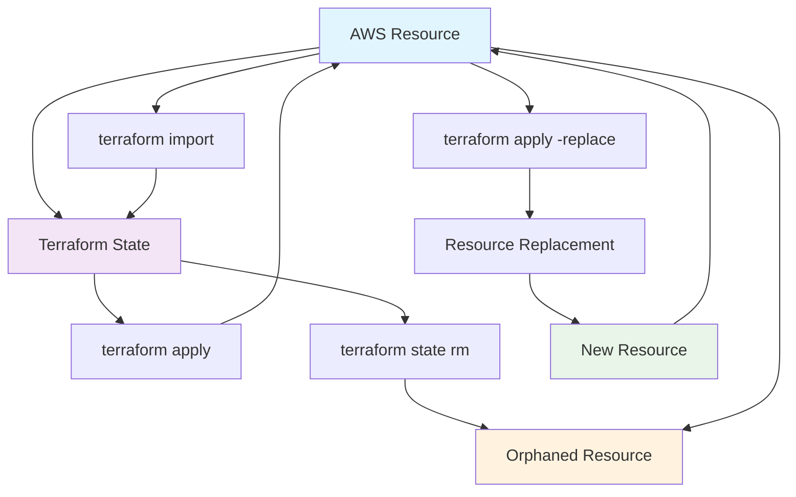
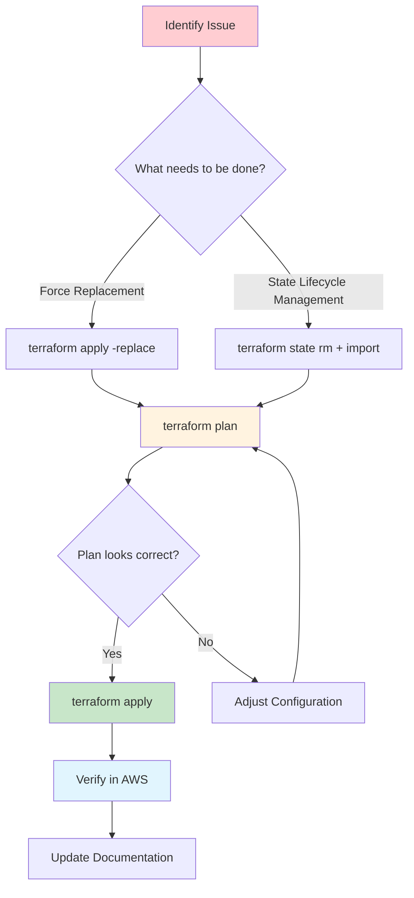

# Terraform State Management Commands Overview

This comprehensive guide covers the three essential Terraform state management commands through hands-on examples.

## 📚 What's Covered

### **3.2.1a - terraform apply -replace**
- **Purpose**: Force resource replacement in a single command (modern approach)
- **Demo**: EC2 instance replacement with user data
- **Key Learning**: Immediate resource replacement for corrupted or misconfigured instances

### **3.2.1b - terraform state rm + terraform import**
- **Purpose**: Combined workflow - remove resources from state and import them back
- **Demo**: S3 bucket state lifecycle - remove from state then import back
- **Key Learning**: Complete resource management workflow without downtime

## 🎯 Learning Objectives

By completing these examples, you'll understand:

✅ **When to use each state management command**
✅ **How state differs from actual AWS resources**
✅ **Best practices for state manipulation**
✅ **Troubleshooting common state issues**
✅ **Recovery strategies for state problems**

## 🔄 Command Relationship



## 📋 Prerequisites for All Examples

1. **AWS Account** with appropriate permissions
2. **Terraform** >= 0.15.2 installed (for -replace support)
3. **AWS CLI** configured: `aws configure`
4. **Unique identifiers** - Change bucket suffixes in each example

## 🚀 Getting Started

### **Recommended Learning Path:**

1. **Start with 3.2.1a (apply -replace)** - Understand modern resource replacement with EC2
2. **Continue with 3.2.1b (state rm + import)** - Master the complete state management lifecycle with S3

### **Quick Start Each Example:**
```bash
# For each example directory
cd terraform_workshop/MTU/3.2.1[a|b]
terraform init
# Follow the README.md instructions
```

## 🎨 State Management Decision Matrix

| Scenario | Command | Use Case | Impact |
|----------|---------|----------|---------|
| **EC2 instance corrupted** | `terraform apply -replace` | Force immediate replacement | Downtime during replacement |
| **Manual server fixes needed** | `terraform apply -replace` | Reset to known state | Instance recreated |
| **S3 bucket to different config** | `terraform state rm + import` | Transfer management | Bucket continues running |
| **Fix state corruption** | `terraform state rm + import` | Clean state, re-import | No downtime |
| **Resource migration** | `terraform state rm + import` | Move between configurations | Smooth transition |
| **Team handoff** | `terraform state rm + import` | Transfer resource ownership | No interruption |

## 🔧 Common Real-World Scenarios

### **Scenario 1: Corrupted EC2 Instance**
```bash
# Instance is compromised or misconfigured
terraform apply -replace="aws_instance.web_server"
# New instance created immediately
```

### **Scenario 2: S3 Bucket State Lifecycle Management**
```bash
# Remove from current state
terraform state rm aws_s3_bucket.app_data
# Import back to new configuration
terraform import aws_s3_bucket.app_data my-app-bucket
# No downtime - resource continues running
```

### **Scenario 3: Fix State Corruption**
```bash
# Clean corrupted state
terraform state rm aws_s3_bucket.corrupted_bucket
# Re-import with correct configuration
terraform import aws_s3_bucket.corrupted_bucket bucket-name
terraform plan  # Should show no changes
```

### **Scenario 4: Development Server Cleanup**
```bash
# Remove from Terraform, keep running for debugging
terraform state rm aws_instance.debug_server
# Manually terminate later when done
```

## 🛡️ Safety Best Practices

### **Before Any State Operation:**
- ✅ **Backup state file**: `terraform state pull > backup.tfstate`
- ✅ **Use state locking**: Remote state with DynamoDB
- ✅ **Test in staging**: Practice on non-production
- ✅ **Document changes**: Keep record of what was modified

### **During State Operations:**
- ✅ **Work incrementally**: One resource at a time
- ✅ **Verify each step**: Check state and AWS console
- ✅ **Plan before apply**: Always run `terraform plan`
- ✅ **Monitor dependencies**: Check what else might be affected

### **After State Operations:**
- ✅ **Test full cycle**: Plan, apply, verify
- ✅ **Update documentation**: Record configuration changes
- ✅ **Clean up artifacts**: Remove temporary files
- ✅ **Communicate changes**: Inform team of state modifications

## 🔄 State Management Workflow



## 📊 Command Comparison Table

| Command | State Change | AWS Change | Reversible | Risk Level |
|---------|-------------|------------|------------|------------|
| `terraform apply -replace` | Resource replaced | Resource destroyed/recreated | No | Medium |
| `terraform state rm + import` | Resource cycled | None | Yes (repeatable) | Low |
| `terraform apply` | Updated | Resources created/modified | No | High |
| `terraform destroy` | Resources removed | Resources deleted | No | Very High |

## 🆚 Modern vs Legacy Commands

### **Modern Approach (Preferred):**
```bash
# Force replacement immediately
terraform apply -replace="aws_instance.web_server"

# State lifecycle management (remove then import)
terraform state rm aws_s3_bucket.app_data
terraform import aws_s3_bucket.app_data existing-bucket-name
```

### **Legacy Approach (Still Works):**
```bash
# Two-step replacement process
terraform taint aws_instance.web_server
terraform apply
```

**Why Modern is Better:**
- ✅ **Single command operation** - No risk of forgetting second step
- ✅ **More explicit intent** - Clear what you're trying to do
- ✅ **Better for automation** - Easier to script and CI/CD
- ✅ **Clearer audit trail** - Actions are explicit in logs

## 🚨 Common Pitfalls and Solutions

### **Pitfall 1: Replace Dependencies**
```bash
# Problem: Replace cascades to dependent resources
terraform apply -replace="aws_vpc.main"
# Shows many resources being replaced

# Solution: Use plan to preview, replace specific resources only
terraform plan -replace="aws_instance.web_server"
```

### **Pitfall 2: State RM Without Cleanup**
```bash
# Problem: S3 buckets accumulate costs
terraform state rm aws_s3_bucket.large_bucket
# Bucket keeps running, still charging

# Solution: Plan cleanup strategy
terraform state rm aws_s3_bucket.large_bucket
aws s3 rm s3://large-bucket --recursive
aws s3 rb s3://large-bucket
```

### **Pitfall 3: Import Configuration Mismatch**
```bash
# Problem: Configuration doesn't match existing resource
terraform import aws_s3_bucket.app_data existing-bucket
terraform plan  # Shows many changes

# Solution: Match configuration exactly
# Use 'terraform state show' to see current attributes
terraform state show aws_s3_bucket.app_data
```

## 🔍 Debugging State Issues

### **Check State Contents:**
```bash
# List all resources in state
terraform state list

# Show specific resource
terraform state show aws_instance.web_server

# Pull entire state
terraform state pull
```

### **Compare State vs Reality:**
```bash
# Refresh state from AWS
terraform refresh

# Check for drift
terraform plan
```

### **Fix Common Issues:**
```bash
# Remove duplicate resources
terraform state rm aws_instance.duplicate

# Fix resource addresses
terraform state mv aws_instance.old_name aws_instance.new_name

# Force refresh
terraform apply -refresh-only
```

## 🧪 Testing Your Understanding

### **Challenge 1: S3 Bucket State Lifecycle**
1. Create an S3 bucket with Terraform
2. Remove it from state (don't destroy)
3. Import it back with modified configuration
4. Verify Terraform can manage it without recreating

### **Challenge 2: Zero-Downtime EC2 Replacement**
1. Create an EC2 instance
2. Replace it using modern approach
3. Verify new instance is created
4. Confirm old instance was replaced

### **Challenge 3: State Cleanup**
1. Create multiple resources
2. Remove some from state
3. Clean up orphaned resources manually
4. Verify remaining resources still managed

## 📚 Additional Resources

### **Terraform Documentation:**
- [State Management](https://www.terraform.io/docs/cli/state/index.html)
- [Apply Replace](https://www.terraform.io/docs/cli/commands/apply.html#replace-address)
- [Import Command](https://www.terraform.io/docs/cli/import/index.html)

### **Best Practices:**
- [HashiCorp State Management Guide](https://learn.hashicorp.com/terraform/state)
- [AWS Provider Documentation](https://registry.terraform.io/providers/hashicorp/aws/latest/docs)
- [Terraform State Best Practices](https://www.terraform.io/docs/language/state/index.html)

### **Advanced Topics:**
- State locking with DynamoDB
- Remote state management
- State file encryption
- Cross-account state access

## 🎯 Next Steps

After mastering these state management commands, consider:

1. **Module Development** - Create reusable Terraform modules
2. **CI/CD Integration** - Automate Terraform in pipelines
3. **State Backends** - Implement remote state with locking
4. **Workspace Management** - Handle multiple environments
5. **Policy as Code** - Implement governance with OPA/Sentinel

## 🔗 Quick Navigation

- [3.2.1a terraform apply -replace](../3.2.1a%20terraform%20apply-replace/) - Force EC2 instance replacement
- [3.2.1b terraform state rm + import](../3.2.1b%20terraform%20state%20rm/) - Complete S3 bucket state lifecycle

---

## 📝 Summary

State management is crucial for maintaining reliable Terraform operations. Each command serves specific purposes:

- **`terraform apply -replace`** - When you need to force replacement (corrupted EC2 instances) - Modern approach
- **`terraform state rm + import`** - When you need complete state lifecycle management (S3 bucket migrations, state fixes) - Combined workflow

Master these commands and you'll be able to handle any state management challenge in your infrastructure journey! 